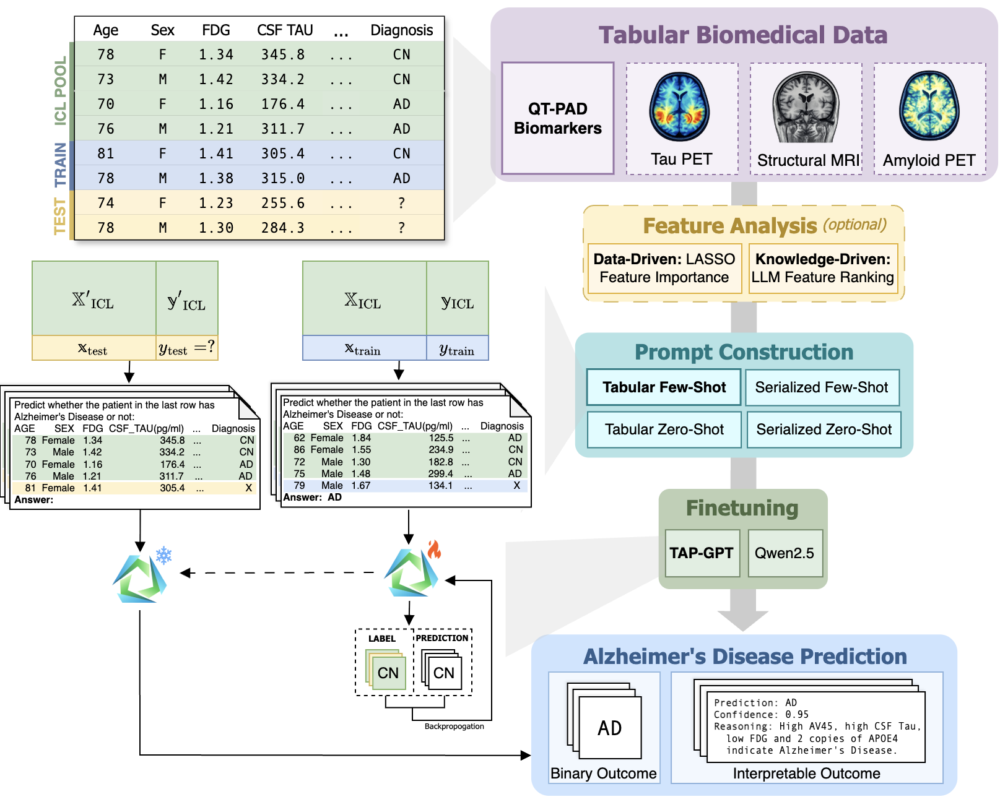

# TAP-GPT  
**Interpretable Few-Shot Alzheimer’s Disease Prediction on Multimodal Biomedical Data with Tabular LLMs**

This repository contains the implementation of **TAP-GPT (Tabular Alzheimer’s Prediction GPT)**, a tabular large language model (LLM) framework for few-shot clinical prediction across multimodal Alzheimer’s disease (AD) datasets.

TAP-GPT extends pretrained tabular foundation models using parameter-efficient fine-tuning and evaluates robustness across multimodal inputs, missing data settings, interpretability constraints, and multi-agent reasoning scenarios.

This code accompanies the IEEE JBHI manuscript:

> *Tabular Large Language Models for Alzheimer's Disease Prediction with Multimodal Biomedical Data*

Which was initially proposed at ACM-BCB 2025 in the manuscript found at https://doi.org/10.1145/3765612.3767229:

> *Enabling Few-Shot Alzheimer’s Disease Diagnosis on Biomarker Data with Tabular LLMs*

---

## Overview

TAP-GPT is designed to:

- Preserve structural relationships in biomedical tabular data (avoiding naive text serialization).
- Enable few-shot in-context learning for clinical prediction.
- Support interpretable reasoning with structured feature attribution.
- Remain stable under self-reflection and multi-agent communication.
- Scale across heterogeneous modalities including tabular and imaging-derived data.

We evaluate TAP-GPT across:

- Multimodal QT-PAD data
- Amyloid PET ROI features
- Tau PET ROI features
- Structural MRI ROI features
- Natural and simulated missingness settings
- High-dimensional feature spaces with feature selection strategies

The graphical abstract can be seen below:


---

## Repository Structure

```
├── core_functions/          # Shared data processing and ICL utilities
├── tasks/                   # Prediction task implementations
├── interpretability/        # Interpretable prompting + structured outputs
├── finetune/                # Finetune TableGPT2 (TAP-GPT) and Qwen2.5
├── data/                    # Store data needed to run and results/metrics
├── logs/                    # Store logs from HPC jobs
└── README.md
```

---

## Data

This repository assumes access to processed datasets derived from:

- QT-PAD tabular data (QT-PAD Challenge, ADNI_adnimerge_20170629_QT-freeze.csv)
- Amyloid PET ROI features (UCBERKELEY_AMY_6MM_08Jul2024.csv)
- Tau PET ROI features  (UCBERKELEY_TAU_6MM_08Jul2024.csv)
- Structural MRI ROI features (UCBERKELEY_AMY_6MM_08Jul2024.csv or UCBERKELEY_TAU_6MM_08Jul2024.csv) 
- ADNI Merged Patient Information (ADNIMERGE_25Aug2025.csv)

Due to ADNI data use restrictions, raw data are **not included**.

The files used for processing data have been merged by PTID and VISCODE with the ADNIMERGE dataset to obtain diagnosis at each visit, then the 68 standard cortical FreeSurfer features were extracted along with 4 subcortical features: Hippocampus, Thalamus, Caudate, and Amygdala. This process generates files titled MRI_DX_multi_visit_subcortical.csv, tau_DX_multi_visit_subcortical.csv, and amyloid_DX_multi_visit_subcortical.csv. Please reach out to Sophie Kearney if you would like more information about this process.

As of now, this repository focuses on the imaging modalities.

---

## Creating task prompts

1. Data is split per modality according to the seed into test (20%), train (40%), and validation sets (10%), each with a corresponding ICL pool (10% each) to draw in-context examples from for prompt creation. These files are saved under data/data_splits
2. If applicable (p!=0), features are selected using LASSO on the training set to reduce the feature space. 
3. For each target sample in the test, train, and validation set, small tables are constructed with k in-context examples, drawn from the corresponding ICL pool. These tables are translated into four prompt types: zero-shot tabular, zero-shot serialized, few-shot tabular, and few-shot serialized. Each prompt format is saved in a separate file in data/task_prompts

---

## Environment

We conducted all experiments with LLMs on a high-performance computing cluster using NVIDIA A100 GPUs (80 GB HBM memory) with 160 GB system RAM per node. We allocated each training job a single GPU, 4 CPU cores, and 1 node under a SLURM scheduler.

The requirements for the python environment for finetuning on HPC can be found in requirements_finetune_env.txt.

Traditional machine learning methods and TabPFN experiments can be run locally.

The requirements for the local python environment can be found in requirements_local_env.txt.

---

## Running tasks

Code to run standard experiments across traditional ML models, TabPFN, and vanilla LLMs can be found in the tasks/ respository. 

tasks/run_tasks.sh will split the data, create the prompts, generate responses from vanilla LLMS (Qwen2.5, Qwen3, TableGPT, TableGPT-R1, and gpt-4.1-mini) and TabPFN, and analyze these results. The raw predictions are stored in data/task_results and the metrics are stored in data/{modality} for each modality being tested. GPT-4.1-mini is accessed with an internal databricks server through the University of Pennsylvania. To submit jobs for all seeds for one modality, use run_full_testing_suite.sh.

Traditional ML methods (SVM, XGBoost, Random Forest, and Logistic Regression) can be run from the same repository using tasks/run_traditionalML.sh.

---

## Finetune TAP-GPT

TAP-GPT can be created by finetuning TableGPT2 for any of the prompt formats for the binary classification task of AD vs CN. Code can be found in finetune/

finetune/run_finetune.sh runs python files to finetune and evaluate both TableGPT2 and Qwen2.5 for these tasks. To bulk submit jobs across all seeds for one modality and task, use run_all_finetune.sh.

Make sure to update the huggingface URL (flagged with TODO) and have the correct READ_TOKEN and WRITE_TOKEN set in the environment.

---

## Interpretable prompts

By default, the prompts ask for a binary classification only. The prompts can be augmented to ask for a structured interpretable prediction in the interpretability/ folder using run_interpretability.sh. Predictions are generated in data/task_results and analyze_interpretable.py calculates metrics which are saved in data/{modality}. All job seeds for one modality can be submitted with run_all_interpretability.sh

Make sure to update the huggingface URL (flagged with TODO) and have the correct READ_TOKEN and WRITE_TOKEN set in the environment.

---

## Acknowledgements

This work was conducted in the Li Shen Lab at the University of Pennsylvania and uses data from the Alzheimer’s Disease Neuroimaging Initiative (ADNI).


## Contact

**For questions:**
Sophie Kearney
sophie.kearney@pennmedicine.upenn.edu
Genomics & Computational Biology @ University of Pennsylvania
